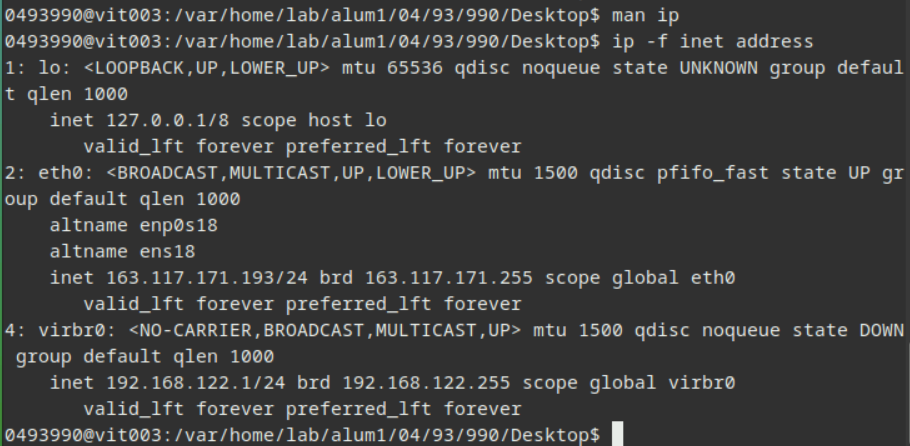
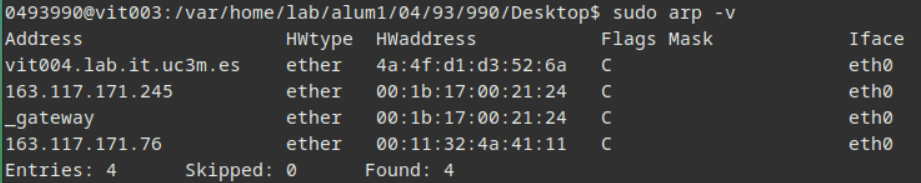
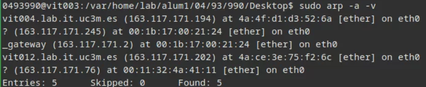
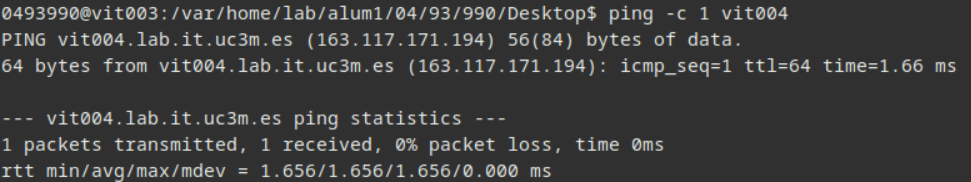
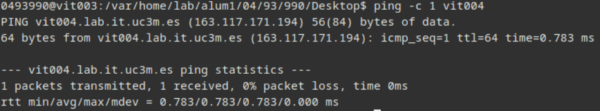
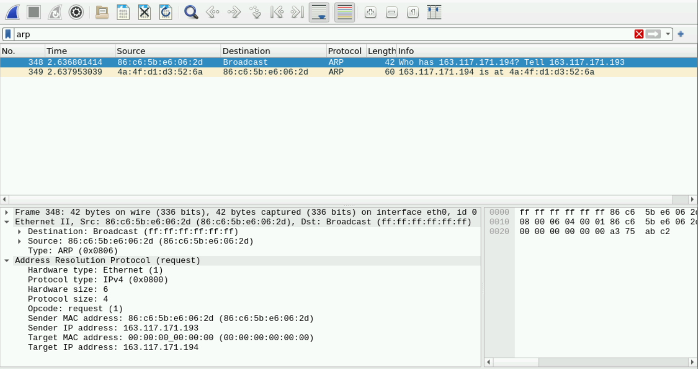
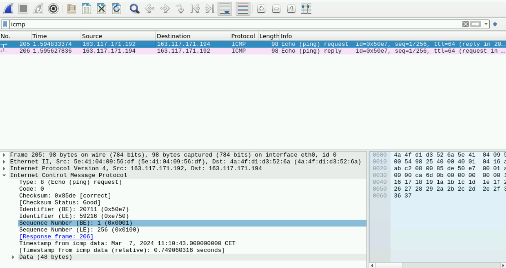
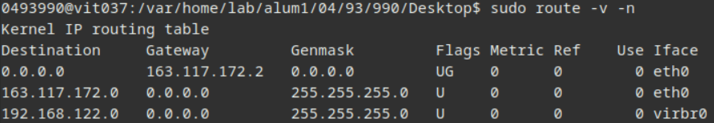
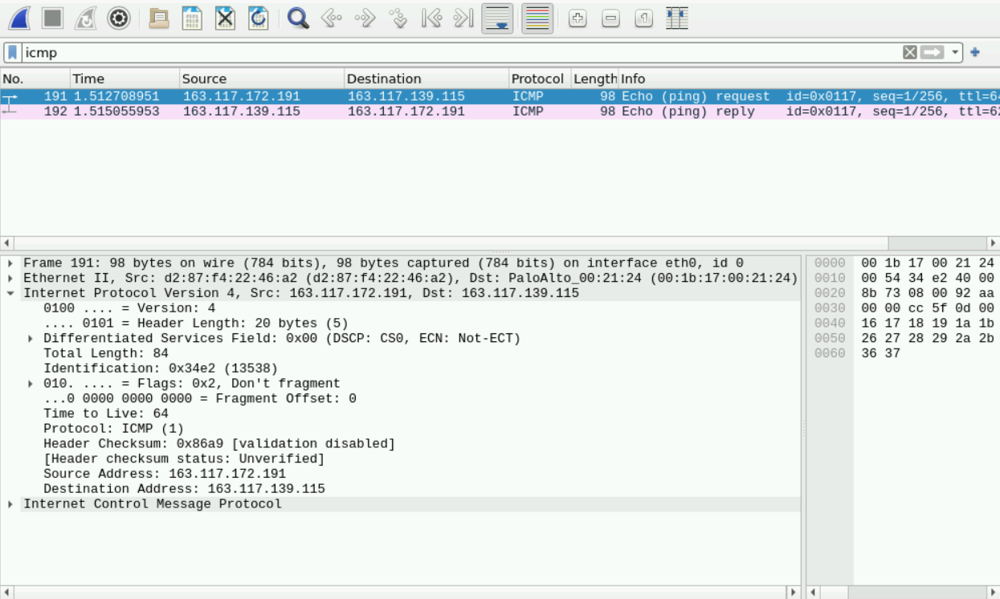

Communication Theory

# Lab 1 Report

Academic year 2023-2024

Alonso Herreros Copete, Jose Alberto Pastor Llorente

---

## 1. Discover your PC configuration

### a. Host name, interfaces and link-level addresses

> The host name is reported as `vit003`. There appear to be 3 network interfaces: `eth0`, `lo`, and `virbr0`.
>
> * The `eth0` interface is of ethernet type with MAC address `86:c6:5b:e6:06:2d`.
> * The `lo` interface doesn't show any address, it's only labeled as `loop`.
> * The `virbr0` interface is of ethernet type with MAC  address `52:54:00:0a:cd:21`.

### b. IPv4 addresses

> * At the `eth0` interface, the IPv4 address is `163.117.171.193` with 24 bits of prefix.
> * At the `lo` interface, the IPv4 address is `127.0.0.1` (localhost) with 8 bits of prefix.
> * At the `virbr0` interface, the IPv4 address is `192.168.122.1` with 24 bits of prefix.
>
> A screenshot of the result of the `ip -f inet address` command is shown below.
>
> 

### c. Lab network

> The network prefix for the lab network is `163.117.171.0/24`. Therefore, the network address is
> `163.117.171.0` and the broadcast address is `163.117.171.255`.
>
> There can be up to 254 hosts assigned to this subnet: there are $2^{32-24}=256$ addresses in total, but 2
> of them are reserved for the network and broadcast addresses, leaving us with 254 addresses for hosts.

## 2. ARP protocol

### c. Locate subnet of another host

> The ping command to `vit004` reported its IP address `163.117.171.194`. Given that the subnet of `vit003` at
> `eth0` is `163.117.171.0/24`, we can assert that `vit004` **is in the same subnet**, since the prefix (24
> bits) is the same.

### d. ARP table

> The ARP table of `vit003` does contain an entry for `vit004`. If the `arp` command is executed with the `-a`
> option, the actual IPv4 address won't be show. Instead, only the name `vit004.lab.it.uc3m.es` will be
> displayed. The screenshots of both results are shown below.
>
> 
>
> 
>
> The second screenshot shows an extra host, `vit012`, which was added to the ARP table at some point between
> the execution of the two commands.

### f. Delete ARP entry, check ARP and re-ping

> The ARP table was checked again, and the entry for `vit004` was successfully removed. Then, the host was
> pinged again, successfully, and the ARP table was checked once more. As expected, the entry for `vit004` was
> added again.

### g. Ping again

> Indeed, **the new ping, with the ARP entry in place, was about twice as fast** as the one when the ARP
> entry was missing. This is due to not having to resolve the MAC address of the destination host, since it
> was already
> known. Screenshots are included.
>
> Ping with ARP entry missing:
> 
>
> Ping with ARP entry present:
> 

### h. Wireshark capture

> The ARP traffic was captured with Wireshark, using the display filter `arp`. The screenshot is shown below.
>
> 
>
> #### ARP Request
>
> | **Ethernet Header** | **Specific address** | **Owner host**     |
> | ------------------- | -------------------- | ------------------ |
> | MAC source          | `86:c6:5b:e6:06:2d`  | `dirMAC_miPC`      |
> | MAC destination     | `ff:ff:ff:ff:ff:ff`  | `dirMAC_broadcast` |
>
>
> | **ARP fields** | **Specific address** | **Owner host**     |
> | -------------- | -------------------- | ------------------ |
> | MAC source     | `86:c6:5b:e6:06:2d`  | `dirMAC_miPC`      |
> | IP sender      | `163.117.171.193`    | `dirIP_miPC`      |
> | MAC target     | `ff:ff:ff:ff:ff:ff`  | `dirMAC_broadcast` |
> | IP target      | `163.117.171.194`    | `dirIP_otherPC`   |
>
> #### ARP Reply
>
> | **Ethernet Header** | **Specific address** | **Owner host**   |
> | ------------------- | -------------------- | ---------------- |
> | MAC source          | `4a:4f:d1:d3:52:6a`  | `dirMAC_otherPC` |
> | MAC destination     | `86:c6:5b:e6:06:2d`  | `dirMAC_miPC`    |
>
>
> | **ARP fields** | **Specific address** | **Owner host**   |
> | -------------- | -------------------- | ---------------- |
> | MAC source     | `4a:4f:d1:d3:52:6a`  | `dirMAC_otherPC` |
> | IP sender      | `163.117.171.194`    | `dirIP_otherPC`  |
> | MAC target     | `86:c6:5b:e6:06:2d`  | `dirMAC_miPC`    |
> | IP target      | `163.117.171.193`    | `dirIP_miPC`     |

## 3. IP traffic within a subnet

> ⚠️ **Important**
>
> This section was done in a different session, and my host was changed from `vit003` to `vit002`. At `eth0`,
> the MAC address changed to `5e:41:04:09:56:df`, while the IP address changed to `163.117.171.192`.
>
> The destination host was still `vit004`, with IP address `163.117.171.194`.

### b. ICMP types

> The ICMP messages exchanged during the ping request and response had types 8 and 0, respectively. These
> correspond to the "Echo Request" and "Echo Reply" messages.

### c. Ping datagram

> Screenshot is shown below.
>
> 
>
> | **MAC Header**  | **Specific address** | **Owner host**   |
> | --------------- | -------------------- | ---------------- |
> | MAC source      | `5e:41:04:09:56:df`  | `dirMAC_miPC`    |
> | MAC destination | `4a:4f:d1:d3:52:6a`  | `dirMAC_otherPC` |
>
>
> | **IP Header**  | **Information**   | **Owner host**  |
> | -------------- | ----------------- | --------------- |
> | IP source      | `163.117.171.192` | `dirIP_miPC`    |
> | IP Destination | `163.117.171.194` | `dirIP_otherPC` |
> | Protocol       | ICMP (01)         |
> | TTL            | 64                |

## 4. IP traffic between subnets

> ⚠️ **Important**
>
> This section was done in a different session, and my host was changed to `vit037`. At `eth0`,
> the MAC address changed to `d2:87:f4:22:46:a2`, while the IP address changed to `163.117.172.191`.

### a. Identifying subnets

> The ping command reported the IP address of `contrabajo.it.uc3m.es` as `163.117.139.115`. Since our subnet
> is `163.117.171.0/24`, we can assert that `contrabajo` **is in a different subnet**, since its first 24 bits
> are different from ours (`163.117.171` vs `163.117.139`).

### b. IPv4 forwarding table

> The IPv4 forwarding table was checked with the `route -v -n` command, where the `-v` option was included to
> ensure the display of all relevant information, and the `n` option was used to replace aliases such as
> `default` or `_gateway` by their actual IPv4 addresses. The screenshot is shown below.
>
> 
>
> The summary table is shown below. Hops marked as `-` mean that the packet is not forwarded, but rather sent
> to the end host, since it is in the same link as the source.
>
> | **Prefix**         | **Output Interface** | **Next hop**    |
> | ------------------ | -------------------- | --------------- |
> | `0.0.0.0/0`        | `eth0`               | `163.117.172.2` |
> | `163.117.172.0/24` | `eth0`               | `-`             |
> | `192.168.122.0`    | `virbr0`             | `-`             |

### c. Default router

> The default router appears to be at `163.117.172.2`. Its MAC address was resolved with the `arp` command,
> and it was found to be `00:1b:17:00:21:24`.

### d. Wireshark capture

> The ICMP traffic was captured with Wireshark, using the display filter `icmp`. The screenshot is shown
> below.
>
> 
>
> | **MAC Header**  | **Specific address** | **Owner host**   |
> | --------------- | -------------------- | ---------------- |
> | MAC source      | `d2:87:f4:22:46:a2`  | `dirMAC_miPC`    |
> | MAC destination | `00:1b:17:00:21:24`  | `dirMAC_router`  |
>
>
> | **IP Header**  | **Information**   | **Owner host**  |
> | -------------- | ----------------- | --------------- |
> | IP source      | `163.117.172.191` | `dirIP_miPC`    |
> | IP Destination | `163.117.139.115` | `dirIP_otherPC` |
> | Protocol       | ICMP (01)         |                 |
> | TTL            | 64                |                 |

### e. Address resolution

#### 1. Cross-subnet ping

> When sending a ping to a host outside of the sender's subnet, ARP is used to figure out the **MAC address of
> the gateway**, using the **gateway's IP address found in the routing table** (in this case,
> `163.117.172.2`). Only then, the router will check the IP header and forward it accordingly.

#### 2. Same-subnet ping

> When sending a ping to a host within the sender's subnet, ARP is used to figure out the **MAC address of the
> destination host**, using the **destination IP address**. Then, the packet is sent directly to the
> destination host.

### f. Decision process

> The source host checks the destination IP address against its forwarding table. If it finds a match, it
> sends the packet through the corresponding interface. If the gateway field is empty, this means the packet
> can be sent directly to the destination host, and the source does so. Otherwise, the source sends the packet
> To the gateway, with the destination IP address in the IP header and the gateway MAC address in the Ethernet
> (or other link-level protocol) header.
